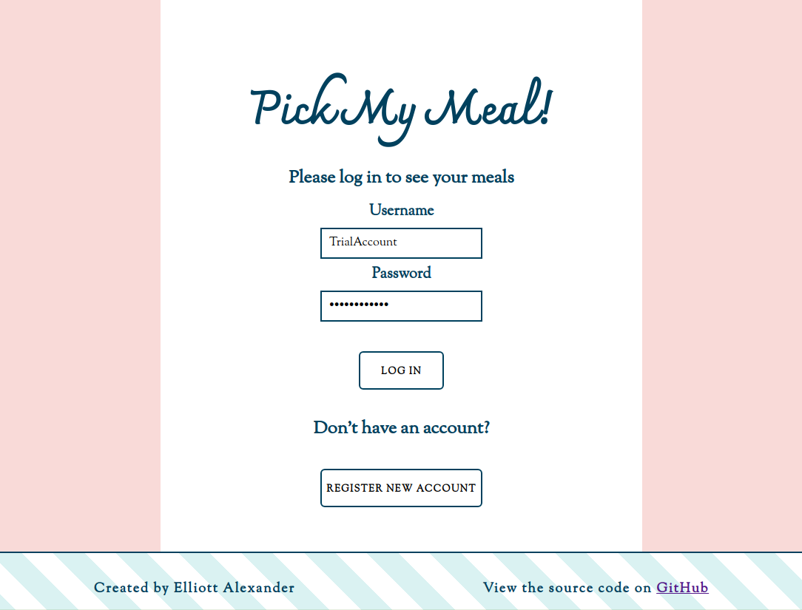
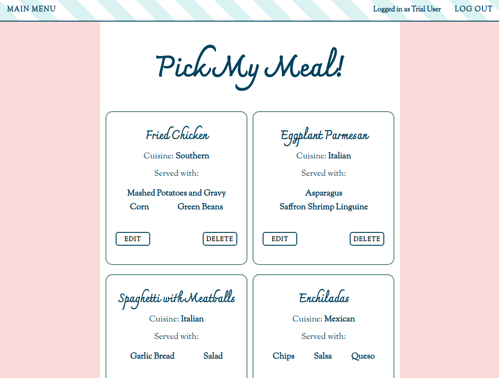
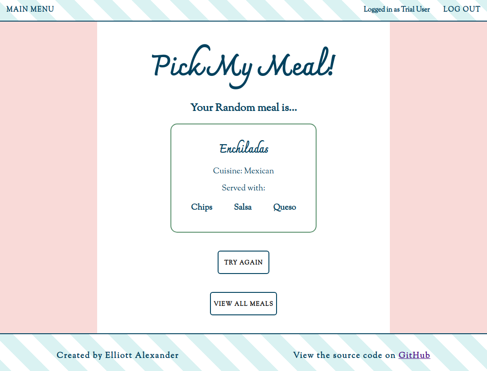

# Pick My Meal - Solving Couples' Greatest Challenge

*"What do you want for dinner, Honey?"*  
*"I don't know, Dear. What do you want?"*

**Can't decide on what to have for dinner? Me too!**

That is why I created Pick My Meal. To help couples land on a meal decision literally at the click of a button.

You can visit a live version of Pick My Meal at this link on Heroku: [Pick My Meal](https://mysterious-wave-24792.herokuapp.com/)  
Be mindful, apps hosted on Heroku take about 30 seconds to spin up before they load.

### How to use Pick My Meal

First, you create an account and login.

Then you add you and your significant other's favorite meals to your meals dashboard.

Then, the next time you see a feud brewing out of meal indecision, you just click the **Random Meal Button**.

Crisis averted.

### Technology used

I had so much fun building Pick My Meal using HTML, CSS, and JavaScript with jQuery handling all of the UI. The back end was built using Node with Express, Mocha with Chai for testing, and MongoDB with Mongoose for the database layer. 
